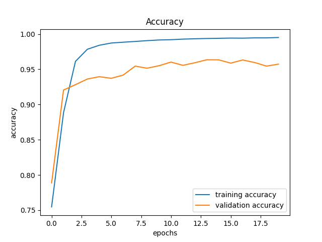
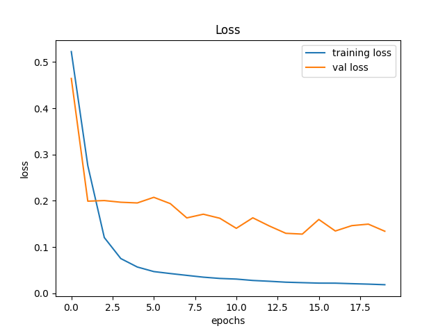
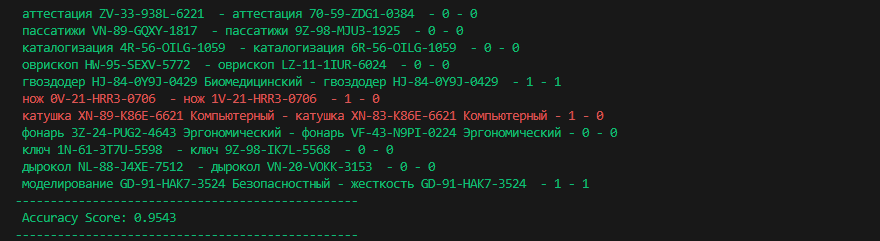

# Модель бинарного классификатора для определения подобия строк содержащих код KKS.

**Задача:**  Обучить модель бинарного классификатора для определения подобия строк содержащих код KKS.

**Пример исходных данных:**
- «Система ЖД обвязки контура 11UDT станции «Первая»», строка для сравнения, например, «Обвязка контура станции «Первая» система 11UDT» считаются идентичными.
- «Лестничный пролет 11UDT15BQ005» строка для сравнения «Лестничный пролет 11UDT16BQ005» считаются не идентичными.

# Решение:
## Шаг 1. Создание набора данных
Для генерации набора данных был разработан скрипт Generator.py. На вход в скрипт подается 4 параметра:
- Операция (operation) - отвечает за тип создаваемой выборки (тренировочная, валидационная, тестовая или все)
- Кол-во (set_number) - отвечает за кол-во генерируемых данных в выборке
- Вероятность (variety) - отвечает за распределение данных между классами 1 и 0
- Директория (path) - отвечает за директорию сохранения сгенерированных данных (файл в формате XXX **.csv**) 

При выборе параметра операции "all" - все остальные параметры вывода будут выбраны поумолчанию.

Первым этапом генератор случайным образом собирает код ККS согласно заданному формату. Так как формат KKS кода может разниться был выбран следующий:

ХХ-ХХ-ХХХX-ХХХХ

Где:

Идентификатор приложения (XX) — это первый сегмент кода KKS. Он представляет собой конкретное приложение или систему на промышленном объекте. Это может быть двухбуквенный код или буквенно-цифровой код, связанный с конкретным процессом, системой или областью.

Основная группа (XX) — это второй сегмент кода KKS. Дополнительно классифицирует оборудование или систему в более широкую категорию. Это может быть цифровой код, связанный с определенной категорией оборудования или системы.

Подгруппа (XXXX) — это третий сегмент кода KKS. Этот уровень классификации предоставляет более подробную информацию об оборудовании или системе в основной группе. Подгруппа помогает сузить классификацию и предоставляет информацию о конкретном подмножестве или варианте в основной группе. Это может быть четырехзначный буквенно-цифровой код, связанный с определенным подмножеством или вариантом оборудования или системы.

Идентификатор объекта: Идентификатор объекта (XXXX) — это последний сегмент кода KKS. Он используется для уникальной идентификации конкретного объекта внутри подгруппы. Идентификатор объекта помогает различать отдельные объекты в одной подгруппе. Это может быть четырехзначный -цифровой код, связанный с конкретным объектом или компонентом внутри подгруппы.

Затем генератор случайным образом добавляет к коду вспомогательные слова - существительное и прилагательное. Наличие в тексте вспомогательных слов или их соотвествие друг друг так же выбирается случайным образом с заданной вероятностью, которую всегда можно настроить вручную. 

Заключительным этапом алгоритм присваевает классы полученным строчкам и сохраняет все в единый csv файл. Прмер сгенерированных данных:
- дырокол VP-35-VZ8C-9397 Фотографический,двигатель VP-35-VZ8C-9397 ,1
- дырокол C6-98-TYD8-6312 ,отвертка C6-98-TYD8-6312 ,1
- нож ZJ-37-WXOT-5127 Вибрационный,циркуль ZJ-37-WXOT-5127 ,1
- рычаг 88-31-HVUG-6656 ,рычаг 6K-35-06HG-9827 ,0
- рулетка 8D-89-A8H9-5571 Микробиологический,якорь 8D-89-A8H9-5571 ,1
- турбулентность NQ-81-YN8N-4612 Электрический,турбулентность NQ-81-YN8N-4612 ,1
- тент W8-62-1WPH-8386 ,цилиндр W8-62-1WPH-8386 ,1
- тренога R9-**59**-YASU-8944 ,тренога R9-**56**-YASU-8944 ,0
- крестовина JV-18-QXCW-7917 Кинематический,крестовина ZN-54-GTNI-9230 Автоматический,0

Всего было сгенерировано 300 000 строк тренирововчных данных , 10 000 тестовых данных и 10 000 валидационных данных. Ознакомиться с набором данных можно в папочке Data текущей репозитории.

## Шаг 2. Разработка модели и обучение
Для достижения искомого результата было разработано несколько различных моделей НС. Были использованы такие алгоритмы как LSTM, GRU & SimpleRNN. Однако наилучшего показателя точности по метрике "Accuracy" достигла сверточная нейронная сеть, состоящая из 16-ти слоев. При этом размер словаря модели составляет 391 410 токенов, максимальная длина - 12 токенов в строке. Модель имеет один вход. Предварительно входные данные трансформируются в одну общую строку сравнения. 

Модель представлена в файле model.py.

Результаты обучения модели представлены на рисунке 1 и 2:

Всего для обучения было выполнено 20 эпох:

Начинаем обучение...

2023-10-01 20:07:12.589630: I tensorflow/stream_executor/cuda/cuda_dnn.cc:384] Loaded cuDNN version 8100

- Epoch 1/20  12000/12000 [==============================] - 127s 10ms/step - loss: 0.5226 - accuracy: 0.7546 - val_loss: 0.4646 - val_accuracy: 0.788
- Epoch 2/20 12000/12000 [==============================] - 124s 10ms/step - loss: 0.2761 - accuracy: 0.8884 - val_loss: 0.1993 - val_accuracy: 0.9205
- Epoch 3/20 12000/12000 [==============================] - 125s 10ms/step - loss: 0.1206 - accuracy: 0.9613 - val_loss: 0.2006 - val_accuracy: 0.9282
- Epoch 4/20 12000/12000 [==============================] - 124s 10ms/step - loss: 0.0752 - accuracy: 0.9784 - val_loss: 0.1970 - val_accuracy: 0.9362
- Epoch 5/20 12000/12000 [==============================] - 124s 10ms/step - loss: 0.0569 - accuracy: 0.9841 - val_loss: 0.1955 - val_accuracy: 0.9395
- Epoch 6/20 12000/12000 [==============================] - 124s 10ms/step - loss: 0.0471 - accuracy: 0.9873 - val_loss: 0.2076 - val_accuracy: 0.9372
- Epoch 7/20 12000/12000 [==============================] - 124s 10ms/step - loss: 0.0428 - accuracy: 0.9884 - val_loss: 0.1940 - val_accuracy: 0.9418
- Epoch 8/20 12000/12000 [==============================] - 124s 10ms/step - loss: 0.0389 - accuracy: 0.9895 - val_loss: 0.1631 - val_accuracy: 0.9545
- Epoch 9/20 12000/12000 [==============================] - 124s 10ms/step - loss: 0.0350 - accuracy: 0.9906 - val_loss: 0.1711 - val_accuracy: 0.9515
- Epoch 10/20 12000/12000 [==============================] - 124s 10ms/step - loss: 0.0322 - accuracy: 0.9916 - val_loss: 0.1624 - val_accuracy: 0.9551
- Epoch 11/20 12000/12000 [==============================] - 124s 10ms/step - loss: 0.0309 - accuracy: 0.9920 - val_loss: 0.1406 - val_accuracy: 0.9602
- Epoch 12/20 12000/12000 [==============================] - 124s 10ms/step - loss: 0.0279 - accuracy: 0.9928 - val_loss: 0.1633 - val_accuracy: 0.9556
- Epoch 13/20 12000/12000 [==============================] - 124s 10ms/step - loss: 0.0261 - accuracy: 0.9933 - val_loss: 0.1457 - val_accuracy: 0.9593
- Epoch 14/20 12000/12000 [==============================] - 124s 10ms/step - loss: 0.0241 - accuracy: 0.9937 - val_loss: 0.1298 - val_accuracy: 0.9635
- Epoch 15/20 12000/12000 [==============================] - 124s 10ms/step - loss: 0.0231 - accuracy: 0.9940 - val_loss: 0.1281 - val_accuracy: 0.9634
- Epoch 16/20 12000/12000 [==============================] - 124s 10ms/step - loss: 0.0221 - accuracy: 0.9943 - val_loss: 0.1597 - val_accuracy: 0.9587
- Epoch 17/20 12000/12000 [==============================] - 124s 10ms/step - loss: 0.0220 - accuracy: 0.9942 - val_loss: 0.1348 - val_accuracy: 0.9632
- Epoch 18/20 12000/12000 [==============================] - 124s 10ms/step - loss: 0.0209 - accuracy: 0.9946 - val_loss: 0.1464 - val_accuracy: 0.9596
- Epoch 19/20 12000/12000 [==============================] - 124s 10ms/step - loss: 0.0199 - accuracy: 0.9946 - val_loss: 0.1496 - val_accuracy: 0.9545
- Epoch 20/20 12000/12000 [==============================] - 124s 10ms/step - loss: 0.0187 - accuracy: 0.9951 - val_loss: 0.1343 - val_accuracy: 0.9573

## Шаг 3. Тестирование разработанной модели

Заключительным этапом выполнялось тестирование разработанной модели. Для этого было проведено 5 экспериментов. Каждый эксперимент на вход модели подавались новые данные в разной пропорции:
1. При первом эксперименте было сгенерировано 10 000 строк в пропорции 50:50 - **Результат работы модели 0.9654 по метрике Accuracy**
2. При втором эксперименте было сгенерировано 15 000 строк в пропорции 60:40 - **Результат работы модели 0.9468 по метрике Accuracy**
3. При третьем эксперименте было сгенерировано 5 000 строк в пропорции 50:50 - **Результат работы модели 0.9678 по метрике Accuracy**
4. При четвертом эксперименте было сгенерировано 20 000 строк в пропорции 60:40 - **Результат работы модели 0.9430 по метрике Accuracy**
5. При пятом эксперименте было сгенерировано 10 000 строк в пропорции 35:75 - **Результат работы модели 0.9543 по метрике Accuracy**

Заключительным этапом модель сохраняет полученный ответ. Результат работы модели представлен в файле result.xlsx. Результаты тестирования представлены в папке "Visual/Test"

